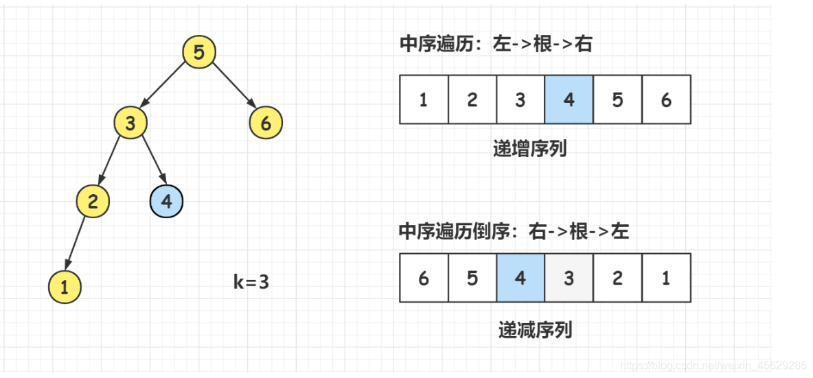

## [54. 二叉搜索树的第k大节点](https://leetcode.cn/problems/er-cha-sou-suo-shu-de-di-kda-jie-dian-lcof/)

<p>
给定一棵二叉搜索树，请找出其中第 k 大的节点的值。
</p>

```
示例 1: 

输入: root = [3,1,4,null,2], k = 1
   3
  / \
 1   4
  \
   2
输出: 4
```

```
示例 2: 

输入: root = [5,3,6,2,4,null,null,1], k = 3
       5
      / \
     3   6
    / \
   2   4
  /
 1
输出: 4
```

> #### 限制:
>
> 1 ≤ k ≤ 二叉搜索树元素个数

<p style="font-size: 14px">
来源：力扣（LeetCode） <br>
链接：https://leetcode.cn/problems/er-cha-sou-suo-shu-de-di-kda-jie-dian-lcof/ <br>
著作权归领扣网络所有。商业转载请联系官方授权，非商业转载请注明出处。
</p>

#### 解题思路和方法：
- dfs

**_要熟悉二叉搜索树的特征：左子树小于跟节点，右子树大于根节点。 dfs从右子树开始将所有值放入数组中，返回第k-1个数值就是第k大的节点值。_**



```typescript
/**
 * Definition for a binary tree node.
 * class TreeNode {
 *     val: number
 *     left: TreeNode | null
 *     right: TreeNode | null
 *     constructor(val?: number, left?: TreeNode | null, right?: TreeNode | null) {
 *         this.val = (val===undefined ? 0 : val)
 *         this.left = (left===undefined ? null : left)
 *         this.right = (right===undefined ? null : right)
 *     }
 * }
 */

function kthLargest(root: TreeNode | null, k: number): number {
  let arr: number[] = []
  function dfs(node: TreeNode | null) {
    if(!node) return
    dfs(node.right)
    arr.push(node.val)
    dfs(node.left)
  }
  dfs(root)
  return arr[k - 1]
};
```

#### leetcode题解精选
- 中序遍历 + 提前返回

```java
class Solution {
    int res, k;
    public int kthLargest(TreeNode root, int k) {
        this.k = k;
        dfs(root);
        return res;
    }
    void dfs(TreeNode root) {
        if(root == null) return;
        dfs(root.right);
        if(k == 0) return;
        if(--k == 0) res = root.val;
        dfs(root.left);
    }
}

作者：jyd
链接：https://leetcode.cn/problems/er-cha-sou-suo-shu-de-di-kda-jie-dian-lcof/solution/mian-shi-ti-54-er-cha-sou-suo-shu-de-di-k-da-jie-d/
来源：力扣（LeetCode）
著作权归作者所有。商业转载请联系作者获得授权，非商业转载请注明出处。
```

- dfs

```cpp
class Solution {
public: 
    int res;
    int kthLargest(TreeNode* root, int k) {
        dfs(root,k);
        return res;
    }
    void dfs(TreeNode* root ,int &k) //传引用 这里需要保证所有dfs函数共用一个k 
    {
        if(!root) return;
        dfs(root->right,k); //右
        k--;
        if(!k) res = root->val; //根
        dfs(root->left,k); //左
    }
};

作者：lin-shen-shi-jian-lu-k
链接：https://leetcode.cn/problems/er-cha-sou-suo-shu-de-di-kda-jie-dian-lcof/solution/zui-jian-jie-yi-dong-de-dai-ma-tu-wen-bi-spxa/
来源：力扣（LeetCode）
著作权归作者所有。商业转载请联系作者获得授权，非商业转载请注明出处。
```

#### 解题总结
##### 什么是二叉搜索树 ？
二叉搜索树是一棵有序的二叉树，所以我们也可以称它为二叉排序树。具有以下性质的二叉树我们称之为二叉搜索树：若它的左子树不为空，那么左子树上的所有值均小于它的根节点；若它的右子树不为空，那么右子树上所有值均大于它的根节点。它的左子树和右子树分别也为二叉搜索树。

> 二叉搜索树的中序遍历是：左=>根=>右； 二叉搜索树的中序遍历从小到大是有序的。

##### 中序遍历模板
```markdown
//打印中序遍历
void dfs(TreeNode* root ) 
{
    if(!root) return;
    dfs(root->left); 	//左
    print(root->val);   //根
   	dfs(root->right);	//右
}
```
