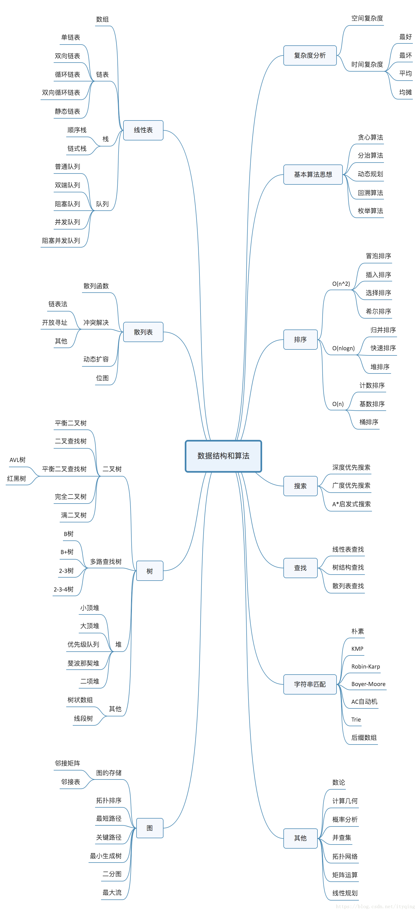
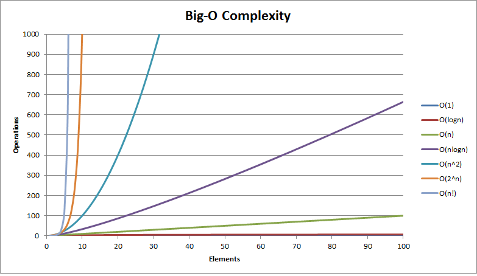

## 算法与数据结构
用一张别人的图来展示算法与数据结构相关知识

### 目录
[基本算法思想](基本算法思想)
- [贪心算法](./基本算法思想/贪心算法.md)
- [分治算法](./基本算法思想/分治算法.md)
- [动态规划](./基本算法思想/动态规划.md)
- [回溯算法](./基本算法思想/回溯.md)
- [分支限界法](./基本算法思想/分支限界法.md)

[排序](./排序/README.md)

[数据结构](./数据结构/README.md)
- [线性结构](./数据结构/线性结构.md)
- [非线性结构](./数据结构/非线性结构.md)

### 几个专业术语和概念
    算法的效率主要由以下两个复杂度来评估：
    时间复杂度：评估执行程序所需的时间。可以估算出程序对处理器的使用程度。
    空间复杂度：评估执行程序所需的存储空间。可以估算出程序对计算机内存的使用程度。

#### 时间复杂度
一般情况下，算法中基本操作重复执行的次数是问题规模n的某个函数，用T(n)表示，若有某个辅助函数f(n)，使得当n趋近于无穷大时，T（n)/f(n)的极限值为不等于零的常数，则称f(n)是T(n)的同数量级函数，记作T(n)=O(f(n))，它称为算法的渐进时间复杂度，简称时间复杂度。

| 复杂度             | 标记符号            | 描述                                                           |
|-----------------|-----------------|--------------------------------------------------------------|
| 常量（Constant）    | O(1)            | 操作的数量为常数，与输入的数据的规模无关。n = 1,000,000 -> 1-2 operations         |
| 对数（Logarithmic） | O(log2 n)       | 操作的数量与输入数据的规模 n 的比例是 log2 (n)。n = 1,000,000 -> 30 operations |
| 线性（Linear）	     | O(n)            | 操作的数量与输入数据的规模 n 成正比。n = 10,000 -> 5000 operations            |
| 平方（Quadratic）	  | O(n^2)          | 操作的数量与输入数据的规模 n 的比例为二次平方。n = 500 -> 250,000 operations       |
| 立方（Cubic）	      | O(n3)           | 操作的数量与输入数据的规模 n 的比例为三次方。n = 200 -> 8,000,000 operations      |
| 指数（Exponential） | O(2n)O(kn)O(n!) | 指数级的操作，快速的增长。n = 20 -> 1048576 operations                    |

而通常时间复杂度与运行时间有一些常见的比例关系：

| 复杂度	         | 10	     | 20	   | 50	     | 100	  | 1000	 | 10000	  | 100000   |
|--------------|---------|-------|---------|-------|-------|---------|----------|
| O(1)         | <1s     | <1s   | <1s     | <1s   | <1s   | <1s     | <1s      |
| O(log2(n))   | <1s     | <1s   | <1s     | <1s   | <1s   | <1s     | <1s      |
| O(n)         | <1s     | <1s   | <1s     | <1s   | <1s   | <1s     | <1s      |
| O(n*log2(n)) | <1s     | <1s   | <1s     | <1s   | <1s   | <1s     | <1s      |
| O(n^2)       | <1s     | <1s   | <1s     | <1s   | <1s   | 2s      | 3-4 min  |
| O(n^3)       | <1s     | <1s   | <1s     | <1s   | 20s   | 5 hours | 231 days |
| O(2^n)       | <1s     | <1s   | 260days | hangs | hangs | hangs   | hangs    |
| O(n!)        | <1s     | hangs | hangs   | hangs | hangs | hangs   | hangs    |
| O(n^n)       | 3-4 min | hangs | hangs   | hangs | hangs | hangs   | hangs    |

使用图示：

其中x轴代表n值，y轴代表T(n)值（时间复杂度）。从图里可以看到：  
T(n)值随着n的值的变化而变化，其中可以看出O(n!)和O(2ⁿ)随着n值的增大，它们的T(n)值上升幅度非常大，而O(logn)、O(n)、O(nlogn)随着n值的增大，T(n)值上升幅度则很小。
常用的时间复杂度按照耗费的时间从小到大依次是：
> O(1) < O(log2(n)) < O(N) < O(n*log2(n)) < O(n^2) < O(n^3) < O(2^n) < O(n!) < O(n^n)
#### 空间复杂度
和时间复杂度类似，一个算法的空间复杂度，也常用大 O 记法表示。

- 如果程序所占用的存储空间和输入值无关，则该程序的空间复杂度就为 O(1)；反之，如果有关，则需要进一步判断它们之间的关系：
- 如果随着输入值 n 的增大，程序申请的临时空间成线性增长，则程序的空间复杂度用 O(n) 表示;
- 如果随着输入值 n 的增大，程序申请的临时空间成 n2 关系增长，则程序的空间复杂度用 O(n2) 表示；
- 如果随着输入值 n 的增大，程序申请的临时空间成 n3 关系增长，则程序的空间复杂度用 O(n3) 表示；
