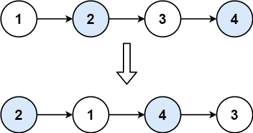

## 24. 两两交换链表中的节点

<p>
给定一个链表，两两交换其中相邻的节点，并返回交换后的链表。

你不能只是单纯的改变节点内部的值，而是需要实际的进行节点交换。
</p>


```
示例 1：

输入：head = [1,2,3,4]
输出：[2,1,4,3]

示例 2：

输入：head = []
输出：[]

示例 3：

输入：head = [1]
输出：[1]
```

> #### 提示： <br>
> 链表中节点的数目在范围 [0, 100] 内
>
> 0 <= Node.val <= 100

<p style="font-size: 14px">
来源：力扣（LeetCode） <br>
链接：https://leetcode-cn.com/problems/swap-nodes-in-pairs/ <br>
著作权归领扣网络所有。商业转载请联系官方授权，非商业转载请注明出处。
</p>

##### 方法：
**_这道题没做出来，看下别人的解决方案吧：_**

https://leetcode-cn.com/problems/swap-nodes-in-pairs/solution/shou-hua-tu-jie-24-liang-liang-jiao-huan-lian-biao/
```
/**
 * Definition for singly-linked list.
 * function ListNode(val, next) {
 *     this.val = (val===undefined ? 0 : val)
 *     this.next = (next===undefined ? null : next)
 * }
 */
/**
 * @param {ListNode} head
 * @param {number} n
 * @return {ListNode}
 */
const swapPairs = (head) => {
  const dummy = new ListNode(0);
  dummy.next = head;
  let prev = dummy;

  while (head && head.next) {
    const next = head.next; // 临时保存head.next，因为head.next待会要改变
    head.next = next.next;
    next.next = head;
    prev.next = next;  

    prev = head;      // 指针更新
    head = head.next; // 指针更新
  }
  return dummy.next;
};

作者：xiao_ben_zhu
链接：https://leetcode-cn.com/problems/swap-nodes-in-pairs/solution/shou-hua-tu-jie-24-liang-liang-jiao-huan-lian-biao/
来源：力扣（LeetCode）
著作权归作者所有。商业转载请联系作者获得授权，非商业转载请注明出处。
```
